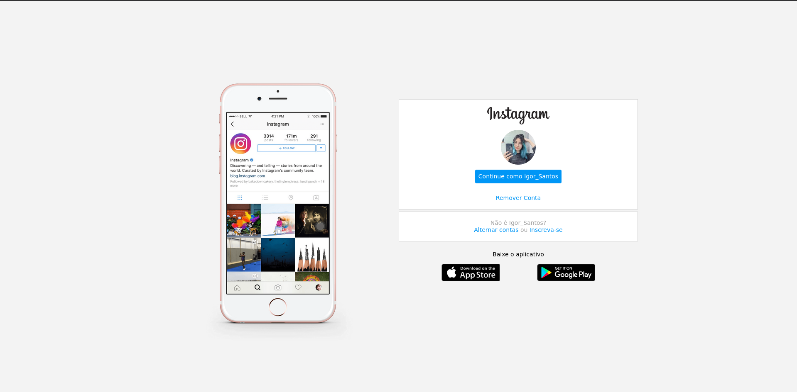
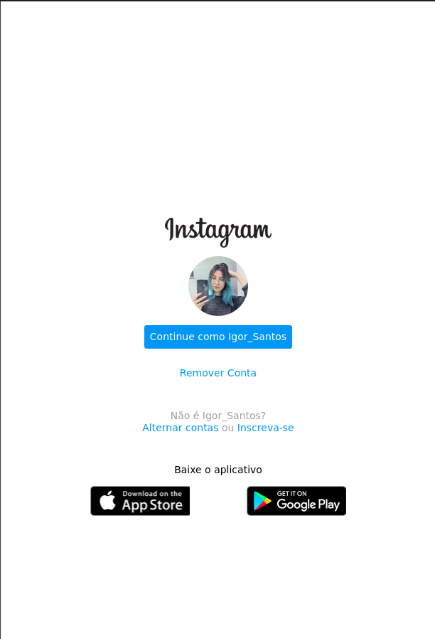

# Clone Instagram

Desafio de projeto proposto pela <a href='https://www.dio.me/en'>DIO</a>.
O desafio consistia em recriar a pagina inicial do Instagram utilizando flexbox com css, trabalhando na disposição e na responsividade dos elementos na página.

